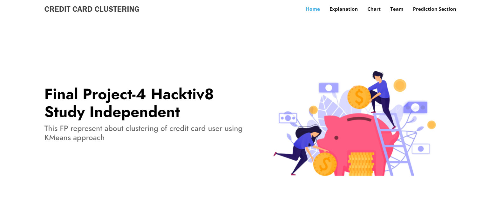
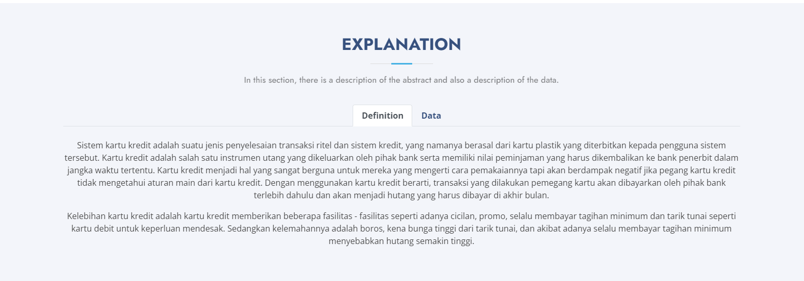
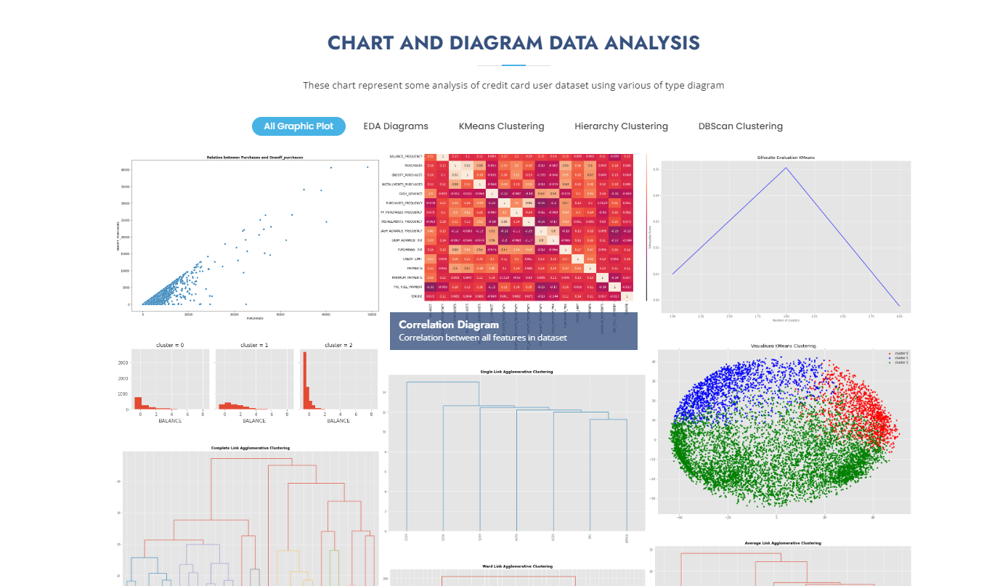
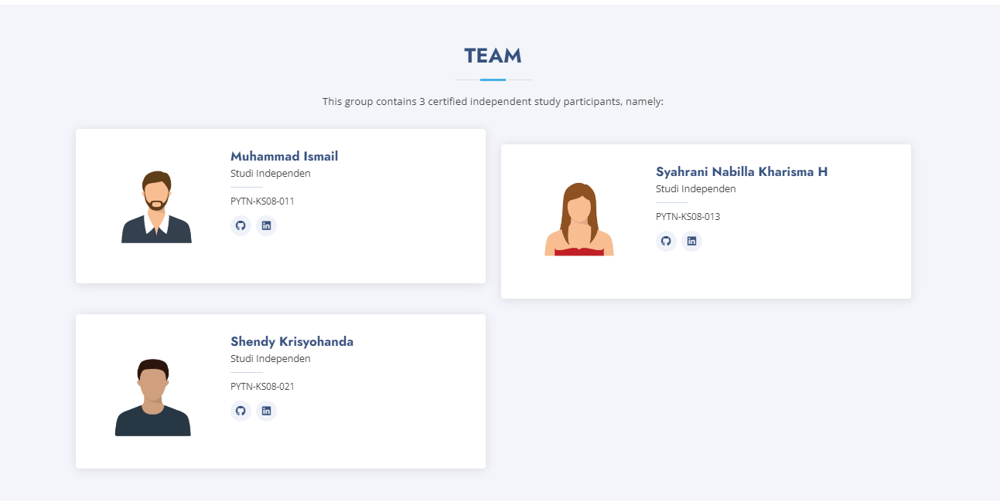
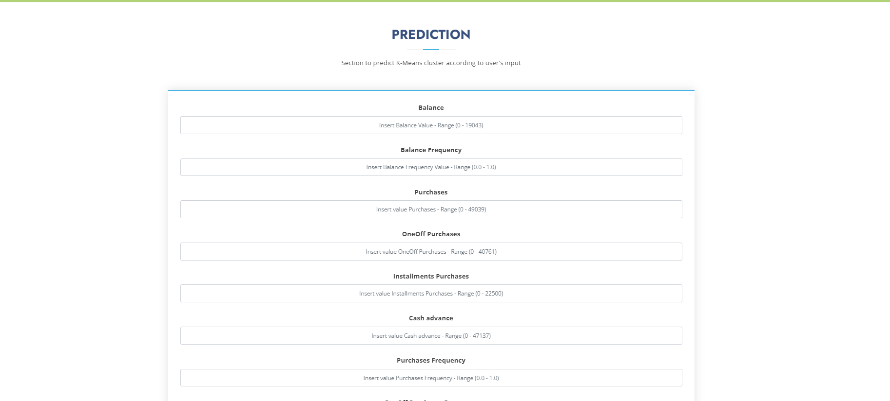

### Kelompok 5 PYTN-KS08

| **No** | **Nama** | **NIM** |
| - | - | - |
| 1. | Muhammad Ismail | PYTN-KS08-011 |
| 2. | Syahrani Nabila Pardede | PYTN-KS08-013 |
| 3. | Shendy Krisyohanda | PYTN-KS08-021 |

# Latar Belakang

Sistem kartu kredit adalah suatu jenis penyelesaian transaksi ritel dan sistem kredit, yang namanya berasal dari kartu plastik yang diterbitkan kepada pengguna sistem tersebut. Kartu kredit adalah salah satu instrumen utang yang dikeluarkan oleh pihak bank serta memiliki nilai peminjaman yang harus dikembalikan ke bank penerbit dalam jangka waktu tertentu. Kartu kredit menjadi hal yang sangat berguna untuk mereka yang mengerti cara pemakaiannya tapi akan berdampak negatif jika pegang kartu kredit tidak mengetahui aturan main dari kartu kredit. Dengan menggunakan kartu kredit berarti, transaksi yang dilakukan pemegang kartu akan dibayarkan oleh pihak bank terlebih dahulu dan akan menjadi hutang yang harus dibayar di akhir bulan.

Kelebihan kartu kredit adalah kartu kredit memberikan beberapa fasilitas - fasilitas seperti adanya cicilan, promo, selalu membayar tagihan minimum dan tarik tunai seperti kartu debit untuk keperluan mendesak. Sedangkan kelemahannya adalah boros, kena bunga tinggi dari tarik tunai, dan akibat adanya selalu membayar tagihan minimum menyebabkan hutang semakin tinggi.

Dataset ada di link berikut <a href="https://www.kaggle.com/datasets/arjunbhasin2013/ccdata">Credit Card Cluster</a>

# Informasi Atribut

| **No** | **Nama Feature** | **Informasi** |
| - | - | - |
| 1. | **CUSTID** | Identification of Credit Card holder (Categorical) |
| 2. | **BALANCE** | Balance amount left in their account to make purchases |
| 3. | **BALANCEFREQUENCY** | How frequently the Balance is updated, score between 0 and 1 (1 = frequently updated, 0 = not frequently updated) |
| 4. | **PURCHASES** | Amount of purchases made from account |
| 5. | **ONEOFFPURCHASES** | 	Maximum purchase amount done in one-go|
| 6. | **INSTALLMENTSPURCHASES** | Amount of purchase done in installment |
| 7. | **CASHADVANCE** | Cash in advance given by the user |
| 8. | **PURCHASESFREQUENCY** | How frequently the Purchases are being made, score between 0 and 1 (1 = frequently purchased, 0 = not frequently purchased) |
| 9. | **ONEOFFPURCHASESFREQUENCY** | How frequently Purchases are happening in one-go (1 = frequently purchased, 0 = not frequently purchased) |
| 10. | **PURCHASESINSTALLMENTSFREQUENCY** | How frequently purchases in installments are being done (1 = frequently done, 0 = not frequently done) |
| 11. | **CASHADVANCEFREQUENCY** | How frequently the cash in advance being paid |
| 12. | **CASHADVANCETRX** | 	Number of Transactions made with style="text-align: center""Cash in Advance" |
| 13. | **PURCHASESTRX** | Number of purchase transactions made |
| 14. | **CREDITLIMIT** | 	Limit of Credit Card for user |
| 15. | **PAYMENTS** | 	Amount of Payment done by user |
| 16. | **MINIMUM_PAYMENTS** | 	Minimum amount of payments made by user |
| 17. | **PRCFULLPAYMENT** | 	Percent of full payment paid by user |
| 18. | **TENURE** | Tenure of credit card service for user |

Dataset ada di link berikut <a href="https://www.kaggle.com/datasets/andrewmvd/heart-failure-clinical-data">Heart Disease</a>

# Fitur Website

## Hero Section

## Explanation Section

## Chart and Diagram Section

## Team Section

## Prediction Section

