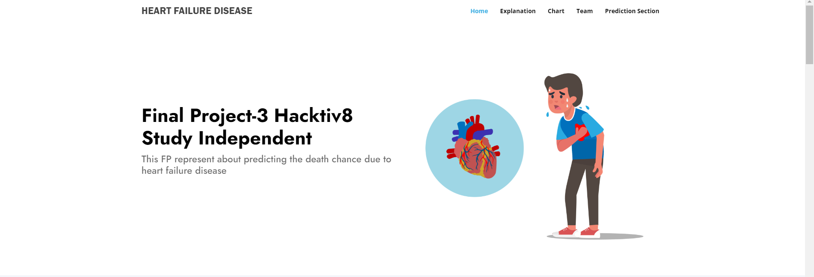
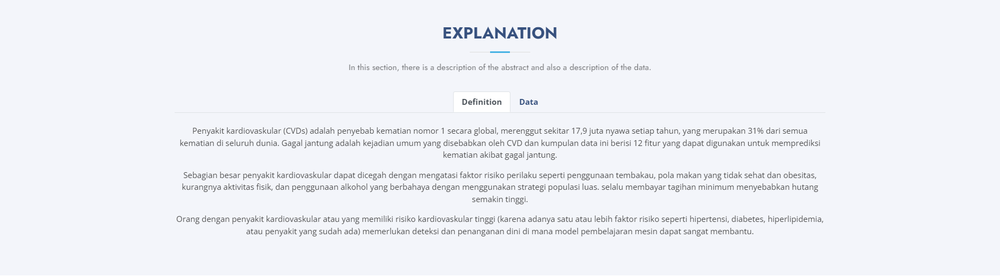
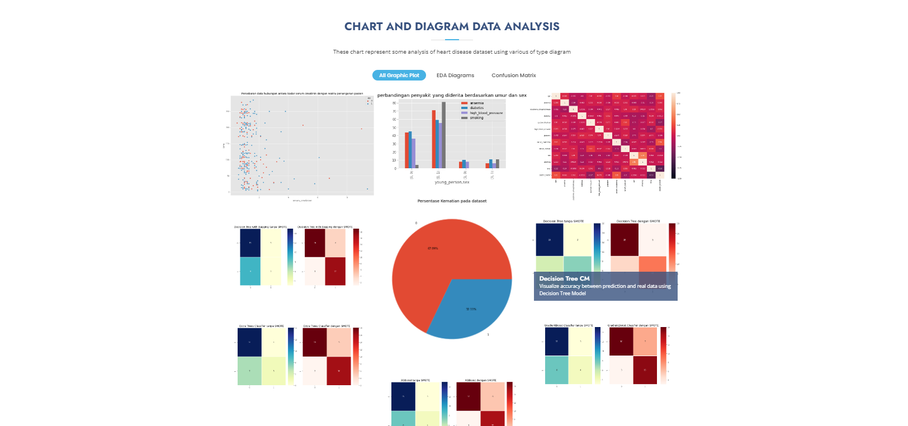
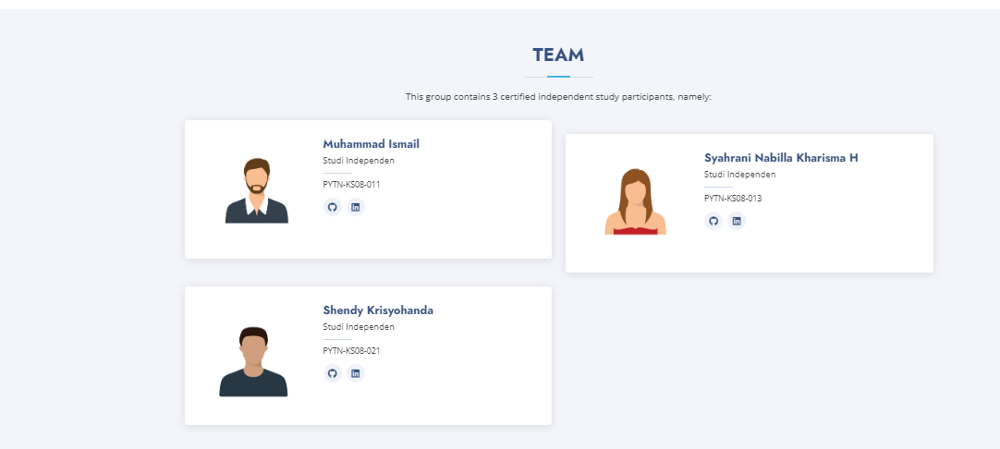
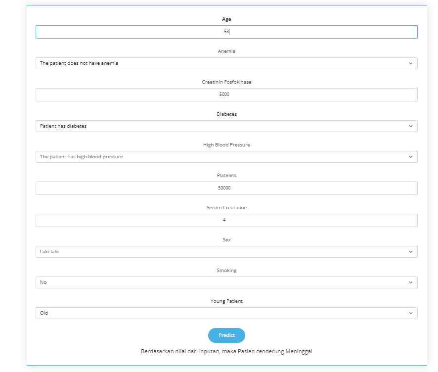

### Kelompok E08, PREFIX IP: 192.196

| **No** | **Nama** | **NRP** |
| - | - | - |
| 1. | Muhammad Ismail | PYTN-KS08-011 |
| 2. | Syahrani Nabila Pardede | PYTN-KS08-013 |
| 3. | Shendy Krisyohanda | PYTN-KS08-021 |

# Latar Belakang

Penyakit kardiovaskular (CVDs) adalah penyebab kematian nomor 1 secara global, merenggut sekitar 17,9 juta nyawa setiap tahun, yang merupakan 31% dari semua kematian di seluruh dunia. Gagal jantung adalah kejadian umum yang disebabkan oleh CVD dan kumpulan data ini berisi 12 fitur yang dapat digunakan untuk memprediksi kematian akibat gagal jantung.

Sebagian besar penyakit kardiovaskular dapat dicegah dengan mengatasi faktor risiko perilaku seperti penggunaan tembakau, pola makan yang tidak sehat dan obesitas, kurangnya aktivitas fisik, dan penggunaan alkohol yang berbahaya dengan menggunakan strategi populasi luas. selalu membayar tagihan minimum menyebabkan hutang semakin tinggi.

Orang dengan penyakit kardiovaskular atau yang memiliki risiko kardiovaskular tinggi (karena adanya satu atau lebih faktor risiko seperti hipertensi, diabetes, hiperlipidemia, atau penyakit yang sudah ada) memerlukan deteksi dan penanganan dini di mana model pembelajaran mesin dapat sangat membantu.

# Informasi Atribut

| **No** | **Nama Feature** | **Informasi** |
| - | - | - |
| 1. | **Age** | Umur Pasien |
| 2. | **Anaemia** | apakah ada pengurangan haemoglobin |
| 3. | **creatinine_phosphokinase** | level enzim CPK dalam mcg/L |
| 4. | **diabetes** | apakah pasien punya riwayat diabetes |
| 5. | **ejection_fraction** | 	persentase darah yang meninggalkan jantung dalam persentasi di setiap kontraksi jantung |
| 6. | **high_blood_pressure** | apakah pasien punya darah tinggi |
| 7. | **platelets** | jumlah platelet di darah dalam kiloplatelets/mL |
| 8. | **serum_creatinine** | level serum creatinine di darah dalam mg/dL |
| 9. | **serum_sodium** | level serum sodium di darah dalam mEq/L |
| 10. | **sex** | apakah pasien pria atau wanita |
| 11. | **smoking** | apakah pasien merokok |
| 12. | **time** | waktu dalam hari untuk follow-up |
| 13. | **DEATH_EVENT** | apakah pasien sudah meninggal saat waktu follow-up |
| 14. | **young_person** | Menentukan apakah pasien muda(kurang 50 tahun) atau tua(diatas 50 tahun) |

Dataset ada di link berikut <a href="https://www.kaggle.com/datasets/andrewmvd/heart-failure-clinical-data">Heart Disease</a>

# Fitur Website

## Hero Section

## Explanation Section

## Chart and Diagram Section

## Team Section

## Prediction Section

